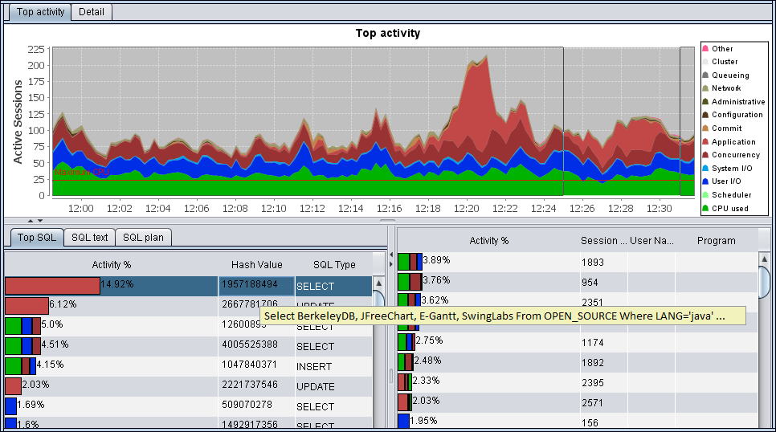
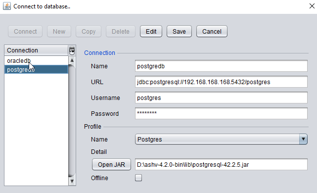
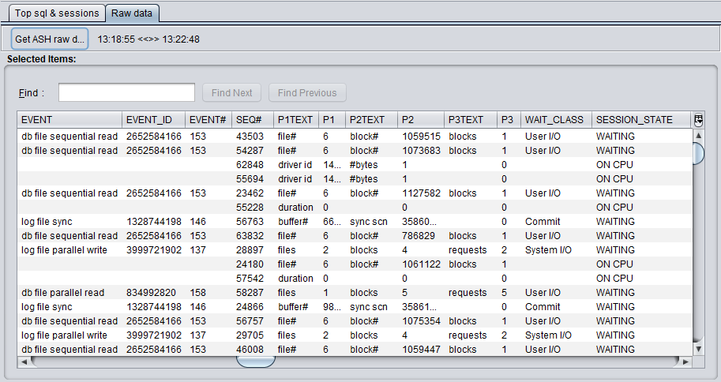
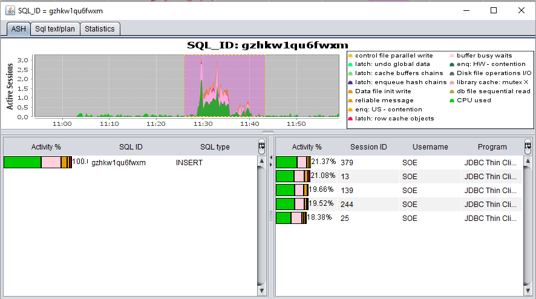
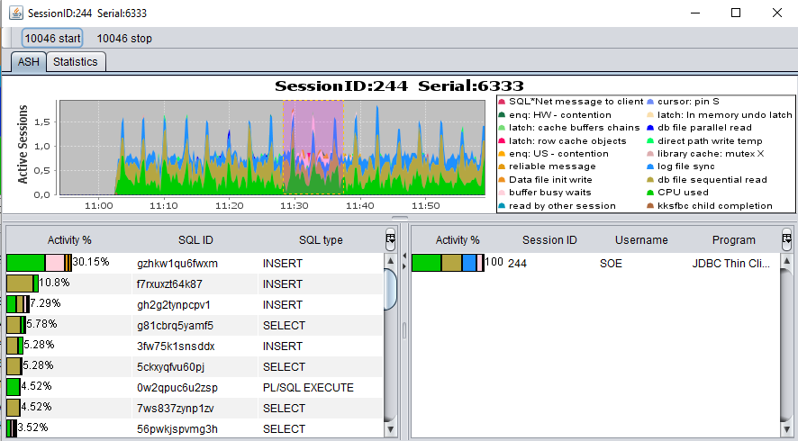

# ASH Viewer

ASH Viewer provides graphical view of active session history data within the database.

Supported databases: Oracle, PostgreSQL

## Table of contents

- [Quick start](#quick-start)
- [How it works](#how-it-works)
- [Security](#security)
- [Bugs and feature requests](#bugs-and-feature-requests)
- [Downloads](#downloads)
- [Based on](#based-on)
- [License](#license)
- [Contact](#contact)

## Quick start
- [Download the latest binary file.](https://github.com/akardapolov/ASH-Viewer/releases)
- Download JDBC driver for your database ([Oracle](https://www.oracle.com/database/technologies/appdev/jdbc-downloads.html), [PostgreSQL](https://jdbc.postgresql.org/download.html))
- Unpack the binary archive and run ASH-Viewer.jar
- Open connection dialog and populate them with data (URL for Oracle database: **jdbc:oracle:thin:@host:port:SID**)

 
- Press Connect button and start to monitor your system

 
- Review Raw data interface to gain a deep insight into active session history

- Double-click on Top sql & sessions interface to get window with ASH details by sql or session ID

   i. SQL
 

   ii. Session
 

## How it works
Active Session History (ASH) is a view in Oracle database that maps a circular buffer in the SGA.
  The name of the view is V$ACTIVE_SESSION_HISTORY. This view is populated every second
  and will only contain data for 'active' sessions, which are defined as sessions
  waiting on a non-idle event or on a CPU.
  
ASH Viewer provides graphical Top Activity, similar Top Activity analysis and Drilldown
    of Oracle Enterprise Manager performance page. ASH Viewer store ASH data locally using
    embedded database Oracle Berkeley DB Java Edition.
    
For Oracle standard edition and PostgreSQL, ASH Viewer emulate ASH, storing active session data on local storage.
  
** Please note that v$active_session_history is a part of the Oracle Diagnostic Pack and requires a purchase of the ODP license.**
  
## Security  
Passwords are stored in configuration file in encrypted form with secret key (computer name or hostname). So, when you run copied configuration on another host, you need to change password with a new secret key. 
This is a minimal foolproof and for maximum protection it is necessary to store sensitive data using filesystem-level encryption or another way.
  
## Bugs and feature requests
Have a bug or a feature request? [Please open an issue](https://github.com/akardapolov/ASH-Viewer/issues)  
  
## Downloads
- [Current version](https://github.com/akardapolov/ASH-Viewer/releases)
- [Old release 3.5.1 on github.com](https://github.com/akardapolov/ASH-Viewer/releases/tag/v3.5.1)
- [Mirror on sourceforge.net](https://sourceforge.net/projects/ashv/files/)   
  
## Based on
- [JFreeChart by David Gilbert](http://www.jfree.org)
- [E-Gantt Library by Keith Long](https://github.com/akardapolov/ASH-Viewer/tree/master/egantt)
- [Berkeley DB Java Edition](http://www.oracle.com/database/berkeley-db)
- [SwingLabs GUI toolkit by alexfromsun, kleopatra, rbair and other](https://en.wikipedia.org/wiki/SwingLabs)
- [Dagger 2 by Google](https://dagger.dev/)

## License

  Code released under the GNU General Public License v3.0
  
## Contact
  Created by [@akardapolov](mailto:akardapolov@gmail.com) - feel free to contact me!